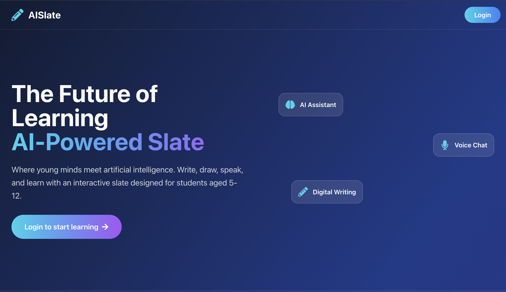
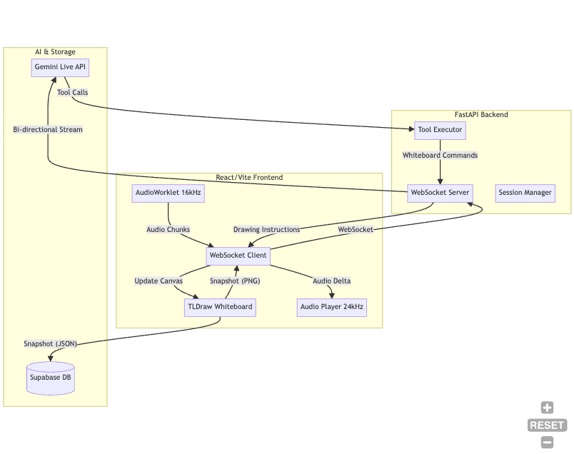

# AI Slate: The Multimodal Collaborative Whiteboard 🎨🎙️

AI Slate is a next-generation digital whiteboard that combines real-time voice interaction with an infinite collaborative canvas. Powered by the **Gemini Live API**, it allows users to talk to an AI assistant while drawing, and the AI can "see" the board and draw back in real-time.

**🚀 [Try the Live Demo](https://aislate.arkarn.fun/)**

 *(Placeholder for your actual app screenshot)*

## ✨ Key Features

- **🎙️ Real-time Voice Interaction**: Low-latency, bidirectional audio powered by Gemini Live.
- **👁️ Multimodal Vision**: The AI "sees" your whiteboard through periodic snapshots and responds to your drawings.
- **✍️ AI Drawing & Tooling**: The AI can draw shapes, write text, and even generate SVGs directly on your canvas.
- **🎨 Infinite Canvas**: Built on top of `tldraw`, providing a smooth and powerful drawing experience.
- **📚 Notebook Management**: Organize your thoughts into multiple notebooks and pages.
- **☁️ Persistent Storage**: Integrated with Supabase to save your sketches and notes automatically.
- **⚡ Modern Tech Stack**: Fast, responsive, and easy to deploy.

## 🏗️ Architecture

AI Slate uses a modern, distributed architecture to handle real-time audio and visual data.



## 🛠️ Tech Stack

- **Frontend**: React 19, Vite, TailwindCSS, `tldraw` (Infinite Canvas), `html2canvas` (Snapshotting).
- **Backend**: FastAPI, WebSockets, Python 3.12+.
- **AI**: Gemini Live API (`google-genai` SDK) for real-time multimodal reasoning.
- **Database**: Supabase (PostgreSQL + RLS) for user sessions and whiteboard persistence.
- **Deployment**: Nixpacks compatible (Render, Railway, etc.).

## 🚀 Getting Started

### Prerequisites

- [uv](https://docs.astral.sh/uv/) (Modern Python package manager)
- [Node.js](https://nodejs.org/) & npm
- A [Google Gemini API Key](https://aistudio.google.com/app/apikey)
- A [Supabase Project](https://supabase.com/)

### Installation

1. **Clone the repository**:
   ```bash
   git clone <your-repo-url>
   cd ai-slate
   ```

2. **Backend Setup**:
   ```bash
   # Install dependencies
   uv sync
   
   # Create .env file
   cat <<EOF > .env
   GEMINI_API_KEY=your_gemini_api_key
   SUPABASE_URL=your_supabase_url
   SUPABASE_ANON_KEY=your_supabase_anon_key
   EOF
   ```

3. **Frontend Setup**:
   ```bash
   cd frontend
   npm install
   
   # Create frontend .env
   cat <<EOF > .env
   VITE_SUPABASE_URL=your_supabase_url
   VITE_SUPABASE_ANON_KEY=your_supabase_anon_key
   EOF
   ```

4. **Database Setup**:
   Run the SQL provided in `supabase_schema.sql` in your Supabase SQL Editor to set up the tables and RLS policies.

### Running Locally

1. **Start the Backend**:
   ```bash
   # From the root directory
   uv run python main.py
   ```

2. **Start the Frontend**:
   ```bash
   # In a new terminal
   cd frontend
   npm run dev
   ```

3. Open your browser to `http://localhost:5173` (or the port provided by Vite).

## 🎯 Usage Guide

1. **Login/Signup**: Use the Supabase-powered authentication.
2. **Create a Notebook**: Start a new project from the sidebar.
3. **Drawing**: Use the TLDraw tools to sketch your ideas.
4. **Talk to AI**: 
   - Click **"Start Recording"**.
   - Speak naturally to the AI. Example: *"Can you draw a diagram of a neural network?"* or *"What do you think of this sketch?"*.
   - The AI will respond via voice and can manipulate the board using its drawing tools.
5. **Auto-Save**: Your work is automatically saved as you draw.

## 🧰 Available AI Tools

The AI assistant is equipped with specialized tools to interact with your whiteboard:

- `write_pure_text`: Adds high-quality text elements.
- `draw_shape_with_text`: Creates geometric shapes (rectangles, circles, etc.) with labels.
- `draw_svg`: Generates complex SVG illustrations based on your descriptions.
- `undo_last_action`: Allows the AI to correct its own mistakes.

## 📜 License

This project is licensed under the MIT License - see the [LICENSE](LICENSE) file for details.

---

Built with ❤️ for the Hackathon. 🚀
